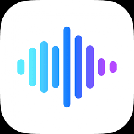
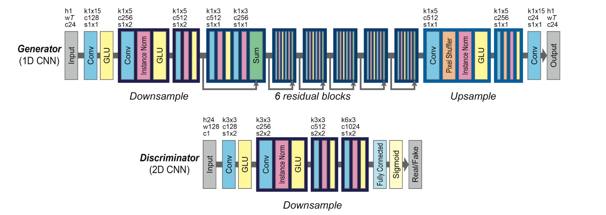

<!-- Improved compatibility of back to top link: See: https://github.com/othneildrew/Best-README-Template/pull/73 -->

<!--
*** Thanks for checking out the Best-README-Template. If you have a suggestion
*** that would make this better, please fork the repo and create a pull request
*** or simply open an issue with the tag "enhancement".
*** Don't forget to give the project a star!
*** Thanks again! Now go create something AMAZING! :D
-->

<!-- PROJECT SHIELDS -->
<!--
*** I'm using markdown "reference style" links for readability.
*** Reference links are enclosed in brackets [ ] instead of parentheses ( ).
*** See the bottom of this document for the declaration of the reference variables
*** for contributors-url, forks-url, etc. This is an optional, concise syntax you may use.
*** https://www.markdownguide.org/basic-syntax/#reference-style-links
-->

<!-- PROJECT LOGO -->
 

  

  <h3 align="center">Voice-Swapper</h3>

  

    Real-time voice conversion using GANs implemented on RPi4.
     
    <a href="https://github.com/IEEE-NITK/Voice-Swapper"><strong>Explore the dataset »</strong></a>
     
     
    
  

<!-- TABLE OF CONTENTS -->

  
Table of Contents

  <ol>
    <li>
      <a href="#about-the-project">About The Project</a>
    </li>
    <li>
      <a href="#objectives">Objectives</a>
    </li>
    <li><a href="#scope">Scope</a></li>
    <li><a href="#roadmap">Roadmap</a></li>
    <li><a href="#contact">Contact</a></li>
    <li><a href="#acknowledgments">Acknowledgments</a></li>
  </ol>

<!-- ABOUT THE PROJECT -->
## About The Project

A voice-changing dictaphone

Voice-Swapper is a dictaphone that will be used to convert the user’s voice(source) to a target voice without any loss of linguistic information. VC is useful in many applications, such as customizing audio book and avatar voices, dubbing, voice modification, voice restoration after surgery, and cloning of voices of historical persons. VC models are primarily implemented with Generative Adversarial Networks(GANs) which provide promising results by generating the user fed-in statements in the target’s voice. We aim to build these models from scratch and implement them on a NVIDIA Jetson, a commonly used, powerful device, for AI applications. This project would be an inter-sig project between Diode and CompSoc.

Use the `README.md` to get started.

(<a href="#readme-top">back to top</a>)

<!-- Objectives -->
## Objectives

To build the generative adversarial network model from scratch. To implement these models on a NVIDIA Jetson. To perform voice swapping (conversion) in real-time.

(<a href="#readme-top">back to top</a>)

<!-- Scope -->
## Scope

If time permits, we aim to propose a novel model based on the survey/summary of model performances in VCC2020 and write a research paper based on its performance compared to the existing models.

Click [here](https://docs.google.com/document/d/1yTXpZWsHaKSjoWy35lg43YfADTnA-_4a/edit) for the complete proposal.

(<a href="#readme-top">back to top</a>)

<!-- Architecture -->
##  Model Architecture

### CycleGAN

One of the important characteristics of speech is that it has sequential and hierarchical structures, e.g., voiced or unvoiced segments and phonemes or morphemes. An effective way to represent such structures would be to use an RNN, but it is computationally demanding due to the difficulty of parallel implementations. 

Instead, we configure a CycleGAN using gated CNNs that not only allow parallelization over sequential data but also achieve state-of-the-art in  speech modeling. In a gated CNN, gated linear units (GLUs) are used as an activation function. A GLU is a data-driven activation function, and the gated mechanism allows the information to be selectively propagated depending on the previous layer states.

### MelGAN

We propose MelGAN-VC, a voice conversion method that relies on non-parallel speech data and is able to convert audio signals of arbitrary length from a source voice to a target voice. We firstly compute spectrograms from waveform data and then perform a domain translation using a Generative Adversarial Network (GAN) architecture. An additional siamese network helps preserving speech information in the translation process, without sacrificing the ability to flexibly model the style of the target speaker.

(<a href="#readme-top">back to top</a>)

<!-- ROADMAP -->
## Roadmap

- [x] Scrape audio files for the target speakers
- [x] Cleanup the audio files
- [x] Perform MEL spectrogram
- [x] Building the models of different architectures
    - [x] Train the model 
    - [x] Test the model

(<a href="#readme-top">back to top</a>)

<!-- CONTACT -->
## Contact

Palgun N P - my0504palsore@gmail.com

Harish Gumnur  - hari.8jan@gmail.com

Nikhil P Reddy - nikhil2002s@gmail.com

Project Link: [https://github.com/IEEE-NITK/Voice-Swapper](https://github.com/IEEE-NITK/Voice-Swapper)

(<a href="#readme-top">back to top</a>)

<!-- MARKDOWN LINKS & IMAGES -->
<!-- https://www.markdownguide.org/basic-syntax/#reference-style-links -->
[contributors-shield]: https://img.shields.io/github/contributors/othneildrew/Best-README-Template.svg?style=for-the-badge
[contributors-url]: https://github.com/othneildrew/Best-README-Template/graphs/contributors
[forks-shield]: https://img.shields.io/github/forks/othneildrew/Best-README-Template.svg?style=for-the-badge
[forks-url]: https://github.com/othneildrew/Best-README-Template/network/members
[stars-shield]: https://img.shields.io/github/stars/othneildrew/Best-README-Template.svg?style=for-the-badge
[stars-url]: https://github.com/othneildrew/Best-README-Template/stargazers
[issues-shield]: https://img.shields.io/github/issues/othneildrew/Best-README-Template.svg?style=for-the-badge
[issues-url]: https://github.com/othneildrew/Best-README-Template/issues
[license-shield]: https://img.shields.io/github/license/othneildrew/Best-README-Template.svg?style=for-the-badge
[license-url]: https://github.com/othneildrew/Best-README-Template/blob/master/LICENSE.txt
[linkedin-shield]: https://img.shields.io/badge/-LinkedIn-black.svg?style=for-the-badge&logo=linkedin&colorB=555
[linkedin-url]: https://linkedin.com/in/othneildrew
[product-screenshot]: images/screenshot.png
[Next.js]: https://img.shields.io/badge/next.js-000000?style=for-the-badge&logo=nextdotjs&logoColor=white
[Next-url]: https://nextjs.org/
[React.js]: https://img.shields.io/badge/React-20232A?style=for-the-badge&logo=react&logoColor=61DAFB
[React-url]: https://reactjs.org/
[Vue.js]: https://img.shields.io/badge/Vue.js-35495E?style=for-the-badge&logo=vuedotjs&logoColor=4FC08D
[Vue-url]: https://vuejs.org/
[Angular.io]: https://img.shields.io/badge/Angular-DD0031?style=for-the-badge&logo=angular&logoColor=white
[Angular-url]: https://angular.io/
[Svelte.dev]: https://img.shields.io/badge/Svelte-4A4A55?style=for-the-badge&logo=svelte&logoColor=FF3E00
[Svelte-url]: https://svelte.dev/
[Laravel.com]: https://img.shields.io/badge/Laravel-FF2D20?style=for-the-badge&logo=laravel&logoColor=white
[Laravel-url]: https://laravel.com
[Bootstrap.com]: https://img.shields.io/badge/Bootstrap-563D7C?style=for-the-badge&logo=bootstrap&logoColor=white
[Bootstrap-url]: https://getbootstrap.com
[JQuery.com]: https://img.shields.io/badge/jQuery-0769AD?style=for-the-badge&logo=jquery&logoColor=white
[JQuery-url]: https://jquery.com 
